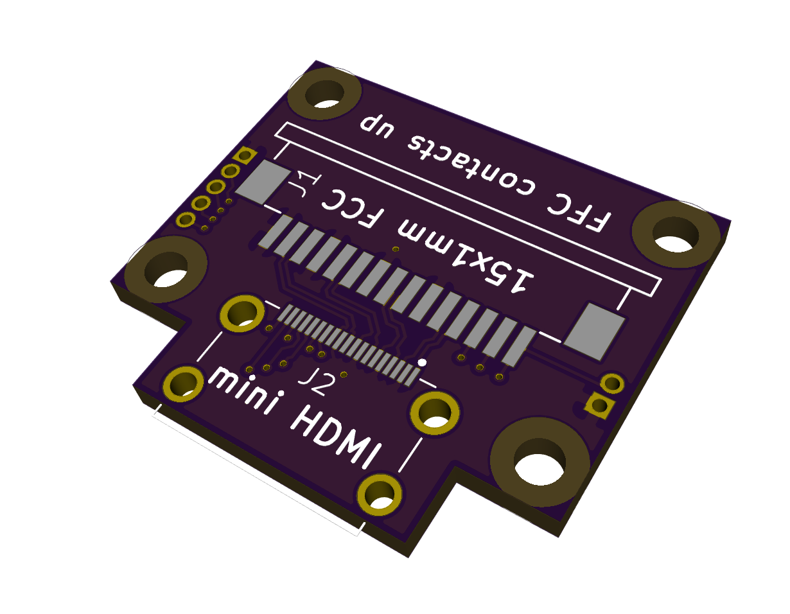
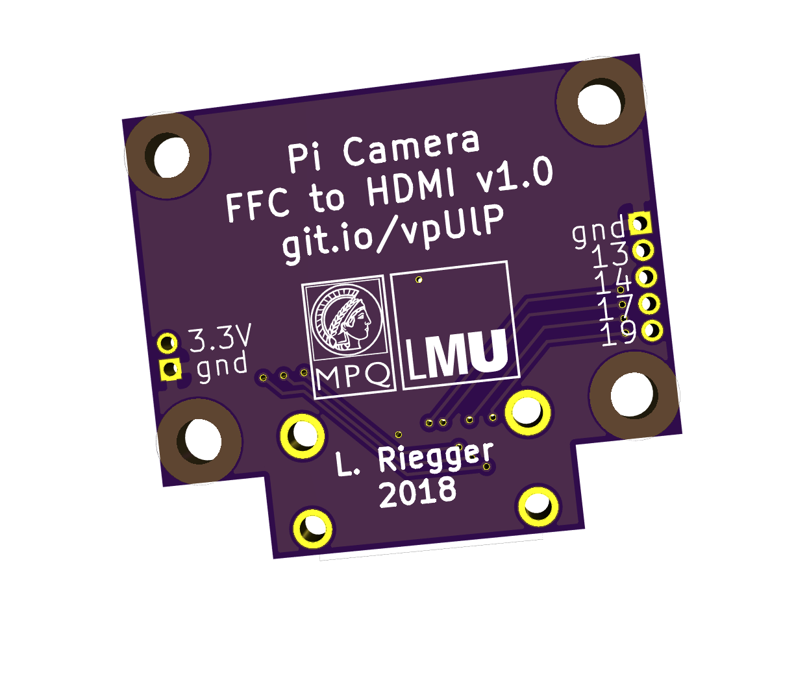

# picamera-hdmi

This is a board to convert the 15x1mm flat flex cable (FFC) from the Pi camera to (mini) HDMI, and from HDMI back to FFC on the Raspberry Pi side.

The purpose of this is to replace the fragile FFC connecting the Pi and the camera with a sturdier HDMI cable for "daily" camera use.
The design is inspired by [this extension board](https://shop.pimoroni.com/products/pi-camera-hdmi-cable-extension).

## Contents

This repository contains the KiCAD schematic, the PCB layout file for the adapter board and instructions for operation and assembly.

## Operation

The required parts for assembly are listed in the schematic, esentially 

- 2 boards
- a mini HDMI cable
- 2 Type 2 FFCs
- 2 mini HDMI and 2 FFC receptacles.

The FFC is inserted into the 15pin connector from one side and the 15 lanes are routed to a subset of the 19 HDMI lanes in a female mini HDMI receptacle.
The four differential data lanes from the camera are mapped to the four HDMI data lanes to preserve the signal quality over the length of the HDMI cable.

- To make sure all the lanes are correctly mapped, use Type 2 FFC (with contacts on opposing surfaces on both cable ends).
- On the camera side, plug the FFC with contacts down on the board.
- On the adapter side plug the FFC with contacts up.
- Same on the Raspberry Pi side. 

There are 4 M2 mounting holes for stacking the board onto the Pi Camera. 

The 4 remaining free lanes of the HDMI cable (13, 14, 17, 19) as well as the ground and 3.3V signals are broken out on the board for convenience.

## Make your own copy

A copy of our converter board can be ordered from OSH park:

<a href="https://oshpark.com/shared_projects/uJnKgfIw"></img></a>
